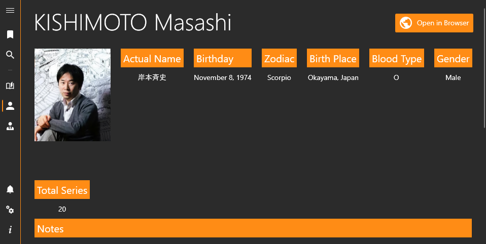

 

  

  <h3 align="center">MangaUpdates Notifications</h3>

  

    An app to check for new series releases using <a href="https://www.mangaupdates.com">MangaUpdates</a>.
     
     
    <a href="https://github.com/FawazTakhji/MangaUpdates-Notifications/wiki">Wiki</a>
    .
    <a href="https://github.com/FawazTakhji/MangaUpdates-Notifications/issues/new?labels=bug&template=bug_report.md">Report Bug</a>
    .
    <a href="https://github.com/FawazTakhji/MangaUpdates-Notifications/issues/new?labels=enhancement&template=feature_request.md">Request Feature</a>
  

  

## Features

* Browsing series/author/publisher info
* Notifications only for certain scanlator groups
* System notifications
* Discord webhook notifications
* Discord bot user notifications
* Discord bot channel notifications
* Pushbullet notifications

## Usage

Download the correct version for your system (x64, x86, ARM64) from the releases page, you can install the app or download a compressed version.

If you want the app to store its data in the app folder you can use the portable command line argument, you might need to start the app as an administrator depending on the folder.
> "MangaUpdates Notifications.exe" -p

**To use this app you will need Windows 10 1809 or a higher version.**

## Uninstallation

### Installer Version

Simply uninstall the app from your system settings.

### Compressed Version

Start the app with the cleanup command line argument
> "MangaUpdates Notifications.exe" --cleanup

This will remove any files or registry entries the app has created, after that you can delete the app.

## Acknowledgements

* [CommunityToolkit.Mvvm](https://github.com/CommunityToolkit/dotnet)
* [H.NotifyIcon](https://github.com/HavenDV/H.NotifyIcon)
* [Microsoft.Toolkit.Uwp.Notifications](https://github.com/CommunityToolkit/WindowsCommunityToolkit)
* [Microsoft.Xaml.Behaviors.Wpf](https://github.com/Microsoft/XamlBehaviorsWpf)
* [ModernWpf](https://github.com/Kinnara/ModernWpf)
* [NLog](https://github.com/NLog/NLog)
* [Newtonsoft.Json](https://github.com/JamesNK/Newtonsoft.Json)
* [Pictogrammers](https://pictogrammers.com)

## Screenshots

---

---

---

---

---
