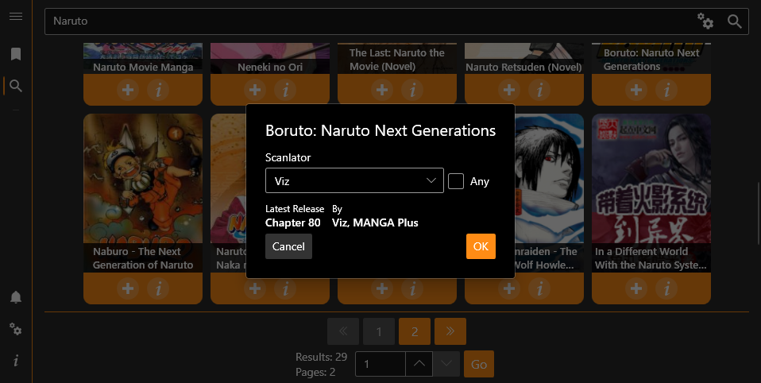
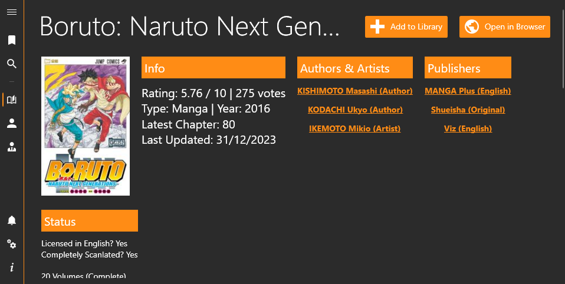

 

  

  <h3 align="center">MangaUpdates Notifications</h3>

  

    A simple app to check for new series releases
     
     
    <a href="https://github.com/FawazTakhji/MangaUpdates-Notifications/issues/new?labels=bug&template=bug_report.md">Report Bug</a>
    .
    <a href="https://github.com/FawazTakhji/MangaUpdates-Notifications/issues/new?labels=enhancement&template=feature_request.md">Request Feature</a>
  

    

## Usage

Download the correct version for your system (x64, x86, ARM64), you can install the program or download a compressed version.
 
**To use this app you will need Windows 10 version 1809 or higher.**

## Uninstallation

### Installer Version

Simply uninstall the program from your system settings.

### Compressed Version

Start the app with the cleanup command line argument
> "MangaUpdates Notifications.exe" --cleanup

This will remove any files or registry entries the program has created, after that you can delete the program folder.

## Features

* Browsing series/author/publisher info
* Notifications only for certain scanlator groups
* System notifications
* Discord webhook notifications
* Discord bot user notifications
* Discord bot channel notifications
* Pushbullet notifications

## Acknowledgements

* [ShaanCoding](https://github.com/ShaanCoding/)
* [Othneil Drew](https://github.com/othneildrew/Best-README-Template)
* [ImgShields](https://shields.io/)

## Screenshots

---

---

---

---

---
